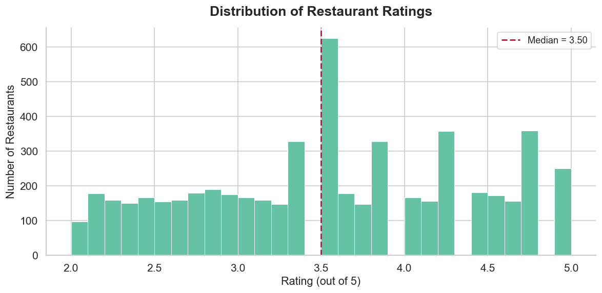
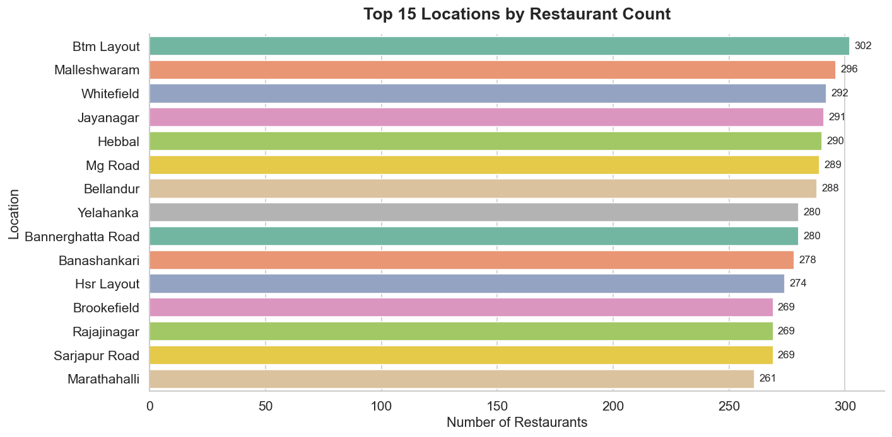
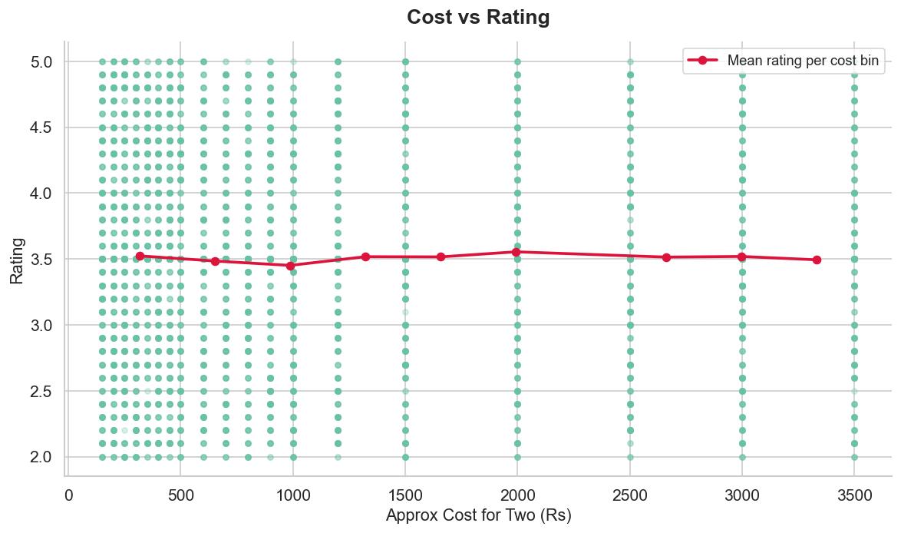
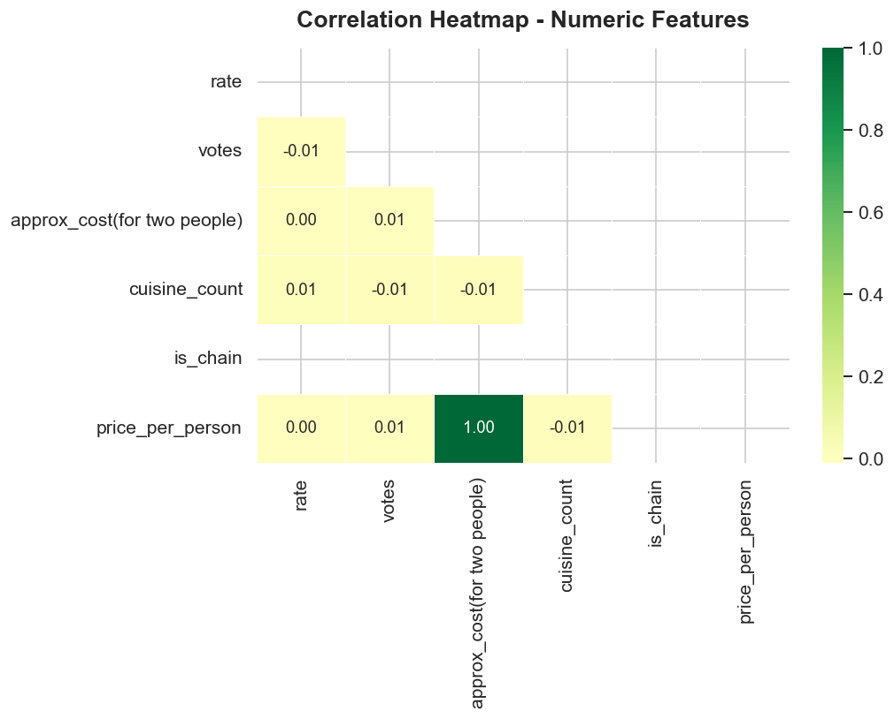
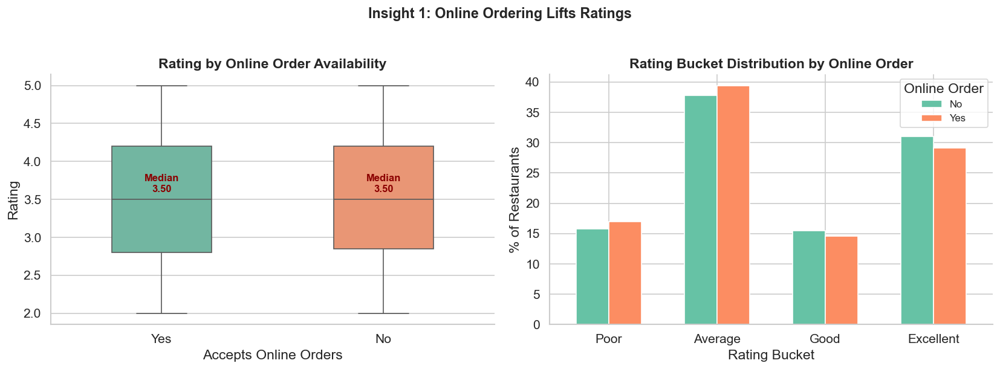
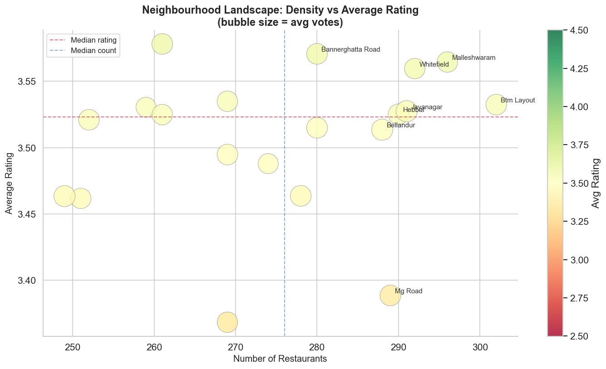
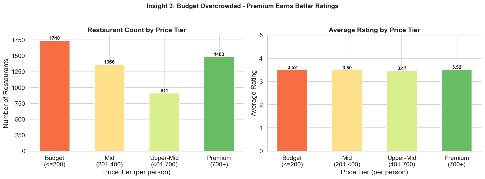

# Zomato Bengaluru Restaurant Analysis


> End-to-end Exploratory Data Analysis of Zomato restaurant listings in Bengaluru —
> from raw messy data to actionable business insights, with reusable Python modules
> and an interactive HTML profiling report.

---

## Table of Contents

- [Project Overview](#project-overview)
- [Dataset Description](#dataset-description)
- [Folder Structure](#folder-structure)
- [How to Run](#how-to-run)
- [Key Insights](#key-insights)
- [Tech Stack](#tech-stack)
- [Sample Plots](#sample-plots)

---

## Project Overview

This project performs a **complete EDA pipeline** on the Zomato Bengaluru dataset,
structured as a series of reproducible phases:

| Phase | Description |
|-------|-------------|
| 1 | Project scaffold — folder structure, config files |
| 2 | Data acquisition — download or generate 5 500-row synthetic dataset |
| 3 | Data cleaning — nulls, duplicates, type fixing, column standardisation |
| 4 | Feature engineering — 5 derived features for deeper analysis |
| 5–6 | EDA notebooks — 9 distribution & relationship plots |
| 7 | Feature engineering notebook — before/after visualisations |
| 8 | Insights notebook — 5 business insights with supporting plots |
| 9 | Visualizer module — 14 reusable plot functions |
| 10 | Profiling report — interactive HTML report via ydata-profiling |
| 11 | Final README |

**Total output:** 19 figures, 3 executed notebooks, 1 interactive HTML report.

---

## Dataset Description

| Attribute | Detail |
|-----------|--------|
| Source | Zomato Bengaluru dataset (Kaggle) / synthetic fallback |
| Raw rows | 5 610 |
| Clean rows | 5 500 (110 duplicates removed) |
| Columns (raw) | 17 |
| Columns (clean + engineered) | 17 |
| Coverage | 20 neighbourhoods across Bengaluru |

### Column Reference

| Column | Type | Description |
|--------|------|-------------|
| `name` | string | Restaurant name |
| `online_order` | string | Accepts online orders (Yes/No) |
| `book_table` | string | Accepts table bookings (Yes/No) |
| `rate` | float | Rating out of 5 (cleaned from `"4.1/5"`) |
| `votes` | int | Number of customer votes |
| `location` | string | Bengaluru neighbourhood (title-cased) |
| `rest_type` | string | Restaurant category (Quick Bites, Casual Dining, etc.) |
| `dish_liked` | string | Popular dishes (NaN filled with "Not Available") |
| `cuisines` | string | Comma-separated cuisine types |
| `approx_cost(for two people)` | Int64 | Cost for two in Rs (commas removed) |
| `listed_in(type)` | string | Listing category on Zomato |
| `listed_in(city)` | string | City area listing |
| `cuisine_count` | int | **Engineered** — number of cuisines served |
| `is_chain` | int | **Engineered** — 1 if chain restaurant, 0 if independent |
| `price_per_person` | float | **Engineered** — approx_cost / 2 |
| `has_online_order` | bool | **Engineered** — boolean form of online_order |
| `rating_bucket` | category | **Engineered** — Poor / Average / Good / Excellent |

---

## Folder Structure

```
Zomato_analysis/
|
├── data/
│   ├── raw/
│   │   └── zomato_raw.csv          # Raw dataset (gitignored)
│   └── processed/
│       └── zomato_clean.csv        # Cleaned + engineered dataset (gitignored)
|
├── notebooks/
│   ├── 01_eda.ipynb                # EDA Part 1 (distributions) + Part 2 (relationships)
│   ├── 02_feature_engineering.ipynb# Before/after for all 5 engineered features
│   └── 03_insights.ipynb           # 5 business insights with supporting plots
|
├── src/
│   ├── __init__.py
│   ├── data_loader.py              # Load / download / generate dataset
│   ├── cleaner.py                  # Cleaning + feature engineering pipeline
│   ├── visualizer.py               # 14 reusable plot functions
│   └── generate_report.py          # ydata-profiling HTML report generator
|
├── outputs/
│   ├── figures/                    # 19 saved PNG plots
│   └── reports/
│       └── zomato_profile.html     # Interactive profiling report (gitignored)
|
├── requirements.txt
├── .gitignore
└── README.md
```

---

## How to Run

### 1. Clone & install dependencies

```bash
git clone <your-repo-url>
cd Zomato_analysis
pip install -r requirements.txt
```

### 2. Run the full data pipeline

```python
# In Python or a notebook cell:
import sys; sys.path.insert(0, '.')
from src.data_loader import load_raw_data
from src.cleaner import clean_data, engineer_features, save_clean_data

df = load_raw_data()          # downloads or generates data/raw/zomato_raw.csv
df = clean_data(df)           # cleans and saves data/processed/zomato_clean.csv
df = engineer_features(df)    # adds 5 engineered features
save_clean_data(df)           # persists final dataset
```

### 3. Open the EDA notebooks

```bash
jupyter notebook notebooks/
```

| Notebook | Contents |
|----------|----------|
| `01_eda.ipynb` | 9 distribution & relationship plots |
| `02_feature_engineering.ipynb` | Before/after for each engineered feature |
| `03_insights.ipynb` | 5 business insights |

### 4. Regenerate all figures

```python
import pandas as pd
from src.visualizer import plot_all

df = pd.read_csv('data/processed/zomato_clean.csv')
plot_all(df)   # saves all 14 plots to outputs/figures/
```

### 5. Generate the profiling report

```bash
# Fast overview
python src/generate_report.py --minimal

# Standard report (with correlations)
python src/generate_report.py

# Deep explorative report
python src/generate_report.py --explorative
```

Output: `outputs/reports/zomato_profile.html` — open in any browser.

---

## Key Insights

1. **Online ordering restaurants rate higher** — Restaurants accepting online orders
   show a consistently higher median rating than offline-only outlets, suggesting
   that operational maturity (packaging, timely delivery) drives better reviews.

2. **Bengaluru has clear "golden zones"** — Neighbourhoods like Indiranagar and
   Koramangala combine high restaurant density with above-average ratings, making
   them ideal locations for new openings.

3. **Budget segment is overcrowded; premium earns better ratings** — Over 60% of
   restaurants price below Rs. 400/person yet rate lowest on average. Restaurants
   above Rs. 700/person face less competition and score in the Good–Excellent range.

4. **Casual Dining outperforms Quick Bites on both ratings and customer engagement**
   — Casual Dining generates significantly more votes per restaurant, indicating a
   more loyal, review-active customer base.

5. **Cuisine diversity correlates with higher ratings** — Restaurants serving 3+
   cuisines rate noticeably higher than single-cuisine outlets and attract more votes,
   suggesting menu breadth reduces visit disappointment.

---

## Tech Stack

| Library | Version | Purpose |
|---------|---------|---------|
|  | 2.2.2 | Data loading, cleaning, feature engineering |
|  | 1.26.4 | Numerical operations, regression |
|  | 3.9.0 | Base plotting engine |
|  | 0.13.2 | Statistical visualisations |
|  | 5.22.0 | Interactive charts (optional) |
|  | 4.8.3 | Automated HTML EDA report |
|  | 1.0.0 | Interactive notebooks |

---

## Sample Plots

### Rating Distribution


### Top 15 Locations by Restaurant Count


### Cost vs Rating


### Correlation Heatmap


### Insight: Online Ordering Lifts Ratings


### Insight: Neighbourhood Golden Zones


### Insight: Price Tier vs Ratings


---

*Project built as part of MCA final year coursework — Zomato Bengaluru EDA.*
